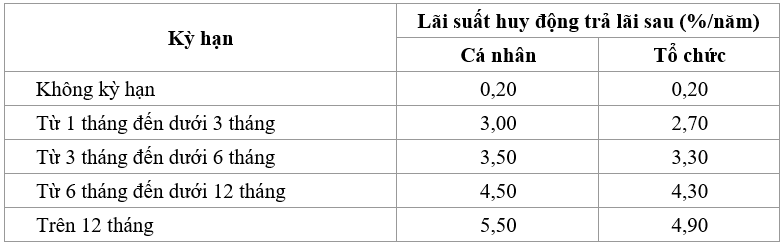

# BT Kiểm thử và đảm bảo chất lượng phần mềm (INT3117_2) - Bank Testing

## Mục lục:
- [I. Bài toán](#i-bài-toán)
- [II. Phân hoạch tương đương](#ii-phân-hoạch-tương-đương)
- [III. Bảng quyết định](#iii-bảng-quyết-định)
- [IV. Kiểm thử dòng điều khiển](#iv-dòng-điều-khiển)
- [V. Kiểm thử luồng dữ liệu](#v-luồng-dữ-liệu)

## I. Bài toán 
Gửi một khoản tiền tiết kiệm vào ngân hàng. Có 2 hình thức gửi tiết kiệm là không kỳ hạn và có kỳ hạn. 
Lãi suất không kỳ hạn là có thể rút tiền bất cứ lúc nào, lãi suất tính theo ngày. 
Có kỳ hạn là phải chờ đến hết hạn tháng mới được rút và chia theo tháng. 
Có 2 loại khách hàng là Cá nhân và Tổ chức. Với lãi suất như bảng dưới đây:

Tính số lãi sau khi gửi.

Số tiền lãi = Số tiền gửi x lãi suất (%/năm) x số ngày thực gửi/365

Số tiền lãi = Số tiền gửi x lãi suất/12 x số tháng thực gửi

## II.	Phân hoạch tương đương
Chi tiết trong file BankTest.java ở thư mục /src/main/test.

Gồm 28 test case. 

## III.	Bảng quyết định:
Chi tiết trong file BankTest.java ở thư mục /src/main/test.

Gồm 15 test case.

## IV. Kiểm thử dòng điều khiển:
Gồm 18 test case.

## III.	Kiểm thử luồng dữ liệu
Gồm 12 test case.

